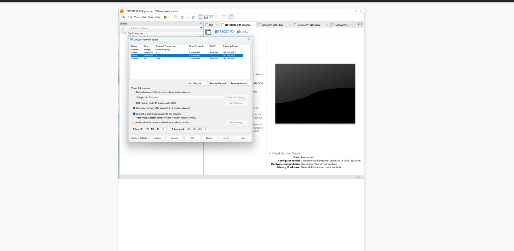
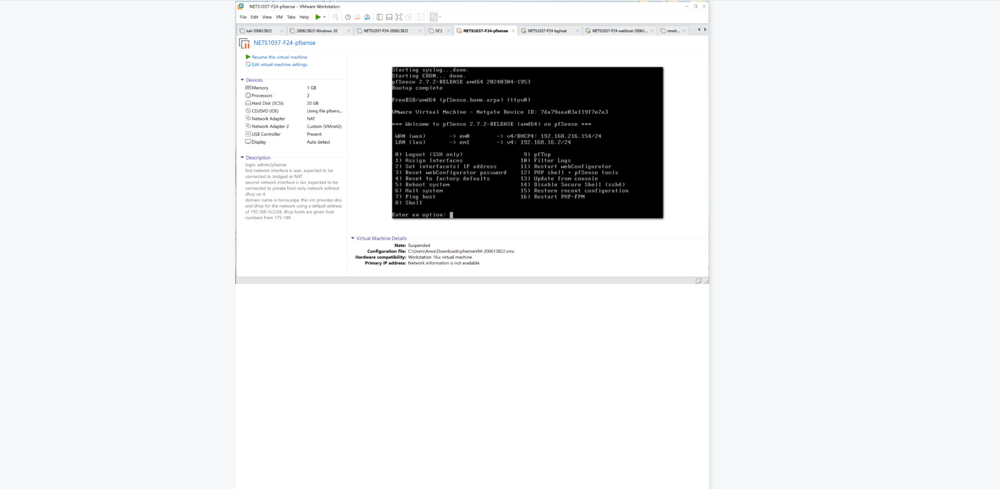
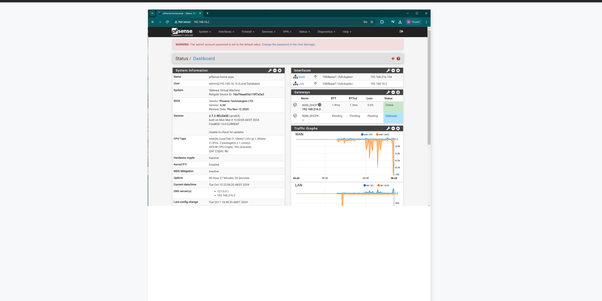
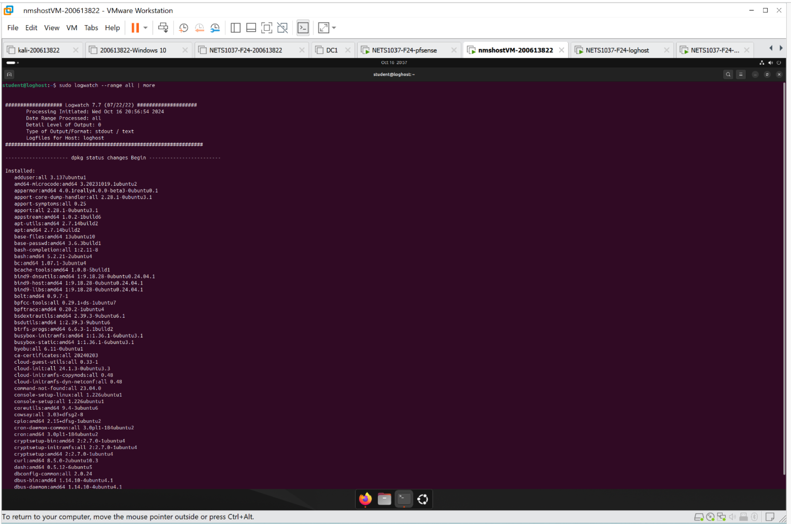
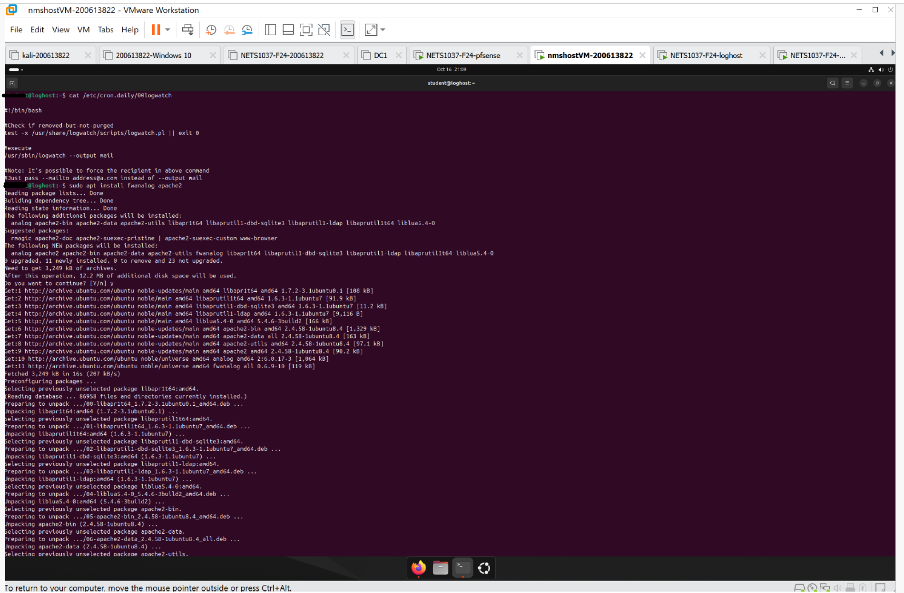
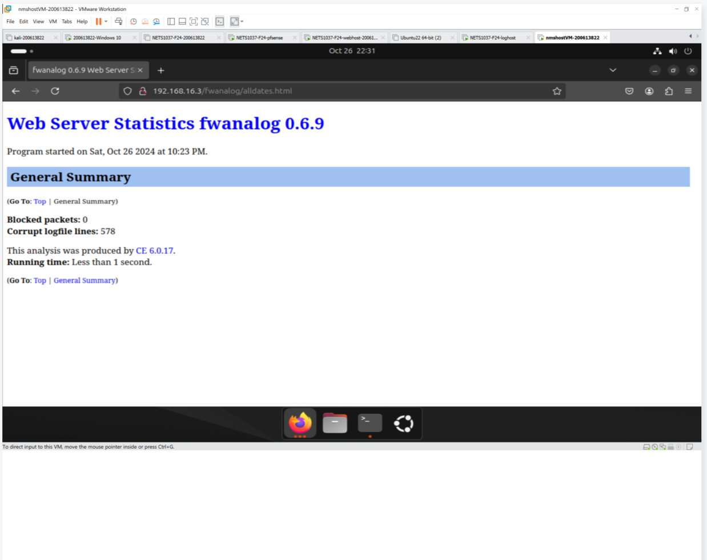
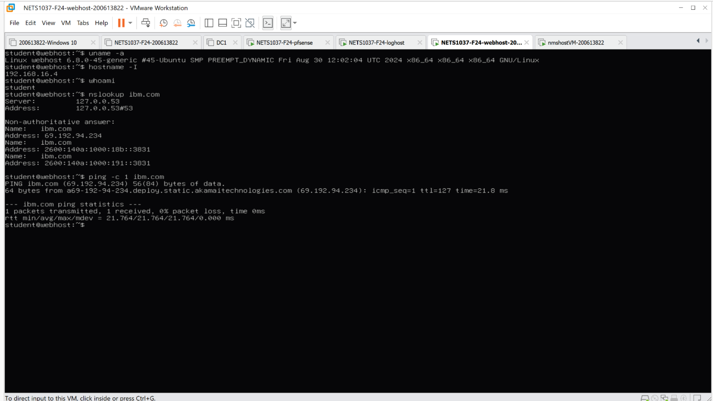

# Centralized-Log-Analysis-and-Monitoring-Using-VMware-and-LogAnalyzer

# Log Analysis Tools Deployment Project

This project showcases the deployment and configuration of log analysis tools in a virtualized environment using VMware, rsyslog, MySQL, and LogAnalyzer. The objective was to create an isolated lab network, deploy servers, and set up tools for centralized and interactive log analysis.

## Objectives
1. Configure a private virtual network in VMware.
2. Deploy and configure four virtual machines:
   - pfSense Router
   - Loghost (Ubuntu Server)
   - Webhost (Ubuntu Server)
   - Nmshost (Ubuntu Desktop)
3. Use tools such as Analog, Fwanalog, Logwatch, and LogAnalyzer for log management and reporting.
4. Implement security measures using UFW and database access controls.
5. Verify all configurations with screenshots.

---

## Project Structure

- **analog, fwanalog run, valid reports generated**  
  _Objective_: Generate valid log analysis reports using Analog and Fwanalog.  

 
 


 











 


- **Webhost VM created, hostname, DNS, IP, user account**  
  _Objective_: Set up the webhost VM with hostname, DNS, and user accounts.  
  _Result_: Successfully created the webhost VM and configured the network.  




  

- **Apache2 installed, Apache2 logging to syslog, firewall configured**  
  _Objective_: Install Apache2 and configure logging to syslog.  
  _Result_: Apache2 was installed, syslog logging was enabled, and UFW was configured. 


 
  

- **Webhost sending logs to MySQL on Loghost**  
  _Objective_: Configure webhost to forward logs to loghost's MySQL database.  
  _Result_: Successfully configured and verified log forwarding.  


  

- **LogAnalyzer running properly**  
  _Objective_: Deploy LogAnalyzer to analyze logs from MySQL in a graphical interface.  
  _Result_: Successfully configured LogAnalyzer and verified log display. 


 
  

---

## Skills Demonstrated

- VMware networking and virtualization.
- Linux system administration.
- Log analysis with Analog, Fwanalog, Logwatch, and LogAnalyzer.
- LAMP stack configuration (Linux, Apache, MySQL, PHP).
- Network and system security using UFW.

---

## Repository Contents

- `README.md`: This documentation file.
- `screenshots/`: Contains all screenshots demonstrating the steps and results.

---

## How to Use

1. Clone this repository:
   ```bash
   git clone https://github.com/<your-username>/Log-Analysis-Tools-Deployment.git
   cd Log-Analysis-Tools-Deployment
